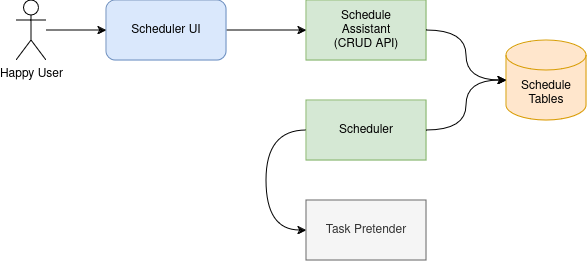

# scheduleman Task Scheduler

This is a docker-based distributed task scheduler in NodeJs and Tyepscript.

## Requirements

### Project Specifications

* Each task executes within (plus or minus) 10 seconds of its scheduled time.
* Schedules are set by:
  - Cron notation,
  - Schedule date and time,
  - A specific amount of time in the future.
* Any number of schedulers can operate concurrently.
* The sudden demise of any scheduler does not drop pending tasks.
* Execution of tasks happen on worker nodes and systems external to the scheduler.

### Assumptions

* Under extreme conditions, eventual consistency is acceptable.

### Adjacent Systems

This project is focused on the scheduler, but there are aspects of this design that bleed over into
other adjacent systems.

There are some additional constraints on tasks themselves.  

* Initiation of tasks cannot take longer than 3 seconds.
* A task that is initiated more than once should not cause degradory affects on the system.

### Future Roadmap Considerations

* Task result tracking.
* Strict task initiation tracking.
* Custom metric tracking for better Auto-Scale Group management.
* UI: Include "Next Execution" in Schedule List.
* Trigger template support.

## Design

### System Design

**Notes**
* Management of schedules is separated from the Scheduler itself.  It can be a "nano-service."
* The DB can be any platform that can scale vertically & horizontally, can look up records by key,
  by user, or by time.
* The Scheduler does not handle execution, only triggering.
* Any number of Schedulers can be running at the same time.  An Auto-Scaling Group should be used
  to manage these.
* Triggering can be done via message queue (Kafka, MQ, SQS, etc), API webhook call, FaaS 
  invocation (AWS Lambda, OpenFaas, etc), or even a workflow invocation (AWS Step Functions, 
  Argo, Airflow, etc).
* The Task Pretender is a simple mock service to pretend it's doing work.

## Points of Concern

### Proof of Concept

To prove out the pattern described in this design, a few shortcuts and simplifications have been 
made:
* The PoC focuses only on API webhook calls.  Other triggering mechanisms would follow the same 
  pattern and be subject to the same constraints. 
* To keep this PoC self-contained, a light-weight `postgresql` instance is included.  Don't expect 
  data to be persisted on shutdown
* Additional association fields for each schedule, such as a calendar id, an owner email address, 
  etc, could be useful, depending on where this would get used.  That's not included in this PoC, 
  but is called out where it could be.
* The list of schedules does not support pagination.  If it gets too big, something might 
  blobglobblerg.

### Cost Analysis

### Error Handling

### Robustness & Resilience

### Dependency Choices

* ORM

* DB

* Parsers

