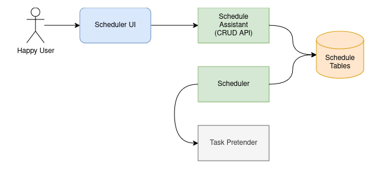

# Scheduleman Task Scheduler

This is a docker-based distributed task scheduler in NodeJs and Tyepscript.

## Requirements

### Project Specifications

1. Each task triggers within (plus or minus) 10 seconds of its scheduled time.
2. Schedules are set by:
  - Cron notation,
  - Schedule date and time,
  - A specific amount of time in the future.
3. Any number of schedule executors can operate concurrently.
4. The sudden demise of any schedule executor does not drop pending triggers.
5. Execution of tasks happen on worker nodes and systems external to the schedule executor.

### Assumptions

1. Under extreme conditions, eventual consistency is acceptable.
2. Different tasks have different tolerances

### Adjacent Systems

This project is focused on the scheduler, but there are aspects of this design that bleed over into
other adjacent systems.

There are some additional constraints on tasks themselves.  

1. Triggering of tasks cannot take longer than 3 seconds.  When triggered, the task execution 
should be queued or asyncronously initiated. 
2. A task that is triggered more than once should not cause degradory affects on the system.  This
can be handled in a number of ways: task idempotency, execution id sentry, repetition tolerance.
The responsibility for this is downstream from the scheduler and is intimiate to the design of each 
task.

## Design

### System Design



**Notes**
* Management of schedules is separated from the Scheduler itself.  It can be a "nano-service."
* The DB can be any platform that can scale vertically & horizontally, can look up records by key,
  by user, or by time.
* The Scheduler does not handle execution, only triggering.  (Perhaps it's misnamed.)
* Any number of Schedulers can be running at the same time.  An Auto-Scaling Group should be used
  to manage these.
* Triggering can be done via message queue (Kafka, MQ, SQS, etc), API webhook call, FaaS
  invocation (AWS Lambda, OpenFaas, etc), or even a workflow invocation (AWS Step Functions,
  Argo, Airflow, etc).
* The Task Pretender is a simple mock service to pretend it's doing work.

### Future Roadmap Considerations

There are a bunch of additional features that become possible once this base system is in place.

* Task result tracking.

A full task tracking system could easily be integrated with this scheduler, allowing each execution
of a task to be monitored, tracked, and potentially re-triggered on failure.

* Task execution manager.

A generic task manager could be built to handle the various patterns related to executions, 
including duplicate execution patterns, job flow patterns and even additional triggering patterns.

* Custom metric tracking for better Auto-Scale Group management.

Auto-Scale Group management could initially be handled by a standard CPU threshold, however it may
be more effective to track custom metrics like "triggers per minute."

* UI: Include "Next Execution" in Schedule List.

It'd be really handy to have "next execution" information in the schedule list.  This could also 
allow filtering out of tasks that have already executed and will not be rescheduled.

* UI: Errors.

The UI is good about reporting when it encounters an error, but it is not good about reporting to 
the user _why_ something failed.  This should be developed out.

* Dead Letters

If a scheduled job fails to trigger more than the number of times configured, it will be dead.  In 
this case, updating the schedule will force a reschedule.  This is a great opportunity for future
development around both monitoring and the UI.

## Points of Concern

### Proof of Concept

To prove out the pattern described in this design, a few shortcuts and simplifications have been 
made:
* The PoC focuses only on triggering tasks by API webhook calls.  Other triggering mechanisms would 
  follow the same pattern and be subject to the same constraints. 
* To keep this PoC self-contained, a light-weight `postgresql` instance is included.  Don't expect 
  data to be persisted on shutdown (though it could, depending on how you kick that docker 
  component).
* Additional association fields for each schedule, such as a calendar id, an owner email address, 
  etc, could be useful, depending on where this would get used.  That's not included in this PoC, 
  but is called out where it could be.
* The list of schedules does not support pagination.  If it gets too big, something might 
  blobglobblerg.

### Cost Analysis

The cost to run this system is very low.  Couch change.  This is partially due to the"separation of 
concerns" in separating the task triggering from the execution.  In a world where there is a direct 
correlation between compute time (big-O) and cost, this isolates and minimizes the overhead of 
managing job schedules.

### Robustness & Resilience

This design has a very high level of robustness and resilience due to the statelessness of the 
schedule executor nodes.  To support this, there are a few implementation details that must be
observed:

1. Grabbing a task to be triggered from the DB must be a single orthogonal transaction.  This 
ensures that two nodes querying at the same time cannot grab the same task.
2. The time-gap in querying for tasks must be randomized.  This ensures that multiple nodes do not
end up in lock-step with each other, and increases the likelihood for tasks to be picked up by any
scheduler node.

### Error Cases

An effort was made to make each component self-recover when it encounters an error.  In most cases,
this seems to recover things fine.  

If a scheduled job fails to trigger more than the number of times configured, it will be dead.  In
this case, updating the schedule will force a reschedule.

### Solution Choices

* File-based Local Module

In this PoC, I used a file-based local module for the common code that's shared across multiple 
components.  This is not an indication of endorsement for this method.  Uhg.

* ORM

My recent work has been almost all with FaaS (Function As A Service, like AWS Lambda) components.
As such, I haven't used an ORM in TypeScript in a while, and didn't want to have to learn the 
gotchas whild juggling this project and work.  So I went with straight SQL, using Yesql to help
manage parameterized queries.

* DB

Any DB would work here, as long as it has basic scalability vertically and horizontally.  Honestly,
with how light-weight this solution is, a standard 2-node DB should be able to handle insane levels
of activities.

* Dates, Time Zones and Epoch Time

All the components run in UTC.  When looking at the scheulded times, keep that in mind.  Further,
when entering a specific "Run At" date-time in the UI, it should also be in UTC.  I didn't solve
the TZ translation issue in this PoC.

* Parsers

I used a few parsers for dealing with translating various time strings to actionable date objects.
There's a cron parser as well as a duration parser.

## Build & Execute

### Layout

The code is separated into the individual components identified by the design.  They're like this:
* `scheduler-storage` contains the database setup stuff.
* `scheduler-crud-api` contains the schedule CRUD REST API.
* `scheduler-executor` contains the scheduler itself.
* `scheduler-ui` contains the React/NextJs UI.
* `scheduler-waitecho` contains a simple echo API which pretends it's triggering a job.

### About Control Scripts

For `scheduler-storage` there is a `build.sh` script.  It takes a single command as an argument.  I 
tried to mirror the `npm` scripts when possible.
* `./build.sh network` creates the network that the DB and **all** the other components use to talk
  with each other.
* `./build.sh package` builds _and creates_ the docker image and container.
* `./build.sh run` starts the container and initializes the database.

Every component except `scheduler-storage` uses `npm` to fulfill its build needs.
* `npm i` installs dependencies.
* `npm run build` compiles (transpiles) the code.
* `npm run package` builds _and creates_ the docker image and container for that component.
* `npm run run` executes the docker container (assuming it's already been built).

There is a `pre*` script set up for the `package`, but not the `run`.  So if you just do 
`npm i && npm run package` it will also run `npm run build` first.  Then run `npm run run` to 
execute it.

For `scheduler-executor` there are a few more scripts for adding additional containers, so you can
see it run as a cloud. For these, the environment variable `N` is used to determine a "node number"
for that container.  The default `package` and `run` work with `N=0`.  So, set it to another number
to make a new one with these scripts:
* `N=1 npm run another` creates another container from the same executor image (with the node 
number `1`).
* `N=1 npm run run` will start that additional container.

### To Build And Run

Ok, so with all of that, here's how to kick up an entire stack of Scheduleman, assuming you're in 
the project root:
```bash
(cd scheduler-common-sdk; npm run build)
(cd scheduler-storage; ./build.sh network)
(cd scheduler-storage; ./build.sh package && ./build.sh run)
(cd scheduler-crud-api; npm run package && npm run run)
(cd scheduler-executor; npm run package && npm run run)
(export N=1; cd scheduler-executor; npm run another && npm run run)
(cd scheduler-waitecho; npm run package && npm run run)
(cd scheduler-ui; npm run package && npm run run)
```

To shut it all down (add in any additional `executor` nodes you started):
```bash
docker stop ui waitecho executor0 executor1 crud-api storage
```

To start it again:
```bash
docker start ui waitecho executor0 executor1 crud-api storage
```

To clean it all up:
```bash
docker remove ui waitecho executor0 executor1 crud-api storage
```

### Usage

Once everything is deployed and running, you can check logs with:
```bash
docker logs -f crud-api
```
Substitute the name of the component whose logs you want to watch.

The UI will be at:
```
http://localhost:3000/
```

When you're setting up a schedule, the "Action URL" to use for this PoC will be:
```
http://waitecho:5003/echo
```
